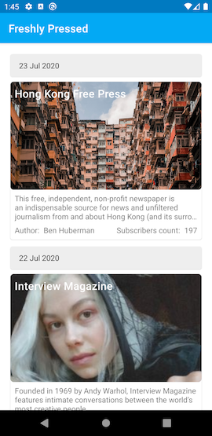
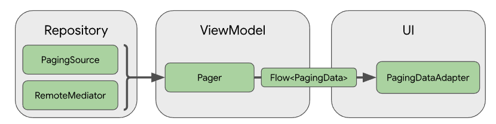

# Freshly Pressed

An Android App that lists the most recent stories from WordPress.com Freshly Pressed.

 

## App Code Architecture

App uses **MVVM** for structuring its code, image of which is below

## Paging

For paging, the app uses [Paging3 Android Library](https://developer.android.com/topic/libraries/architecture/paging/v3-overview) introduced on Google I/O, 2020. The app not only fetches data from WordPress API but also caches it in local database which is implemented using **Room**

## Few Other Code Details
- **Kolin Coroutines and Flow** has been used for asynchronous logic. 
- **[Hilt](https://developer.android.com/training/dependency-injection/hilt-android), written on top of Dagger2, by Google,** now officially recommend library by Google, has been used for Dependency Injection.
- **Retrofit2** has been used for API integration which comes out of the box support for Kotlin Coroutines.
- **Data Transfer Objects (for API request/response)**, **Domain Objects (for use in app UI and business logic)**, and **Entities (for local database)** have been kept separate, intentionally, so that each can evolve independently of each other.
- **RecyclerView** has been used for showing list of items.
- **CardView** has been used for showing cards in the list.
- **ConstraintLayout** has been used for efficient layouts.
- **Material Design Theme** has been used in the app to take advantage of the material design components.
- All strings are translatable and no string is hard coded.
- All colors are themable and now color has been hard coded.
- All dimensions are configurable as no dimension has been hard coded.
- Custom Styles has been used to apply styling to views so that different themes can have different styles.
- Unit tests have been written for all classes. For integration and end-to-end tests, fake data sources have been defined and used.